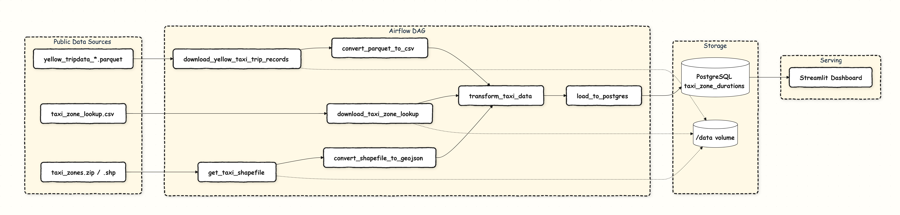

# NYC Taxi Zone Duration Pipeline

An end-to-end data engineering project that ingests **NYC TLC yellow-taxi trip records**, enriches them with **taxi zone reference data**, computes **average trip duration per zone**, loads the result into **PostgreSQL**, and serves it through a **Streamlit dashboard** — all orchestrated with **Apache Airflow**.

---

## Table of Contents

- [The Data Engineering Problem](#the-data-engineering-problem)
- [Architecture](#architecture)
- [Pipeline Stages](#pipeline-stages)
- [Repository Structure](#repository-structure)
- [Data Model](#data-model)
- [Getting Started](#getting-started)
- [Running the Pipeline](#running-the-pipeline)
- [The Dashboard](#the-dashboard)
- [Configuration](#configuration)
- [Testing](#testing)
- [Tech Stack](#tech-stack)

---

## The Data Engineering Problem

### What the business wants to know

> *"Which NYC taxi zones have the longest average trip durations?"*

This sounds trivial, but the raw data makes it surprisingly hard. It exposes three classic data engineering problems:

**1. The raw data answers a different question than the one being asked.**
The TLC trip file (`yellow_tripdata_*.parquet`) contains one row per trip, with `tpep_pickup_datetime` and `tpep_dropoff_datetime` — but **no trip duration column**. Duration must be *derived* (`dropoff - pickup`), filtered for obviously invalid records, and then *aggregated* from ~3M trip rows down to ~260 zone-level averages before it is useful.

**2. The trip data has no human-readable geography.**
Trips only carry integer identifiers (`PULocationID`, `DOLocationID`). The names — *"JFK Airport"*, *"Upper East Side South"*, *"Queens"* — live in a **completely separate** reference file (`taxi_zone_lookup.csv`). Answering the question requires reconciling two disjoint datasets through a join key that was never designed to be a primary key, and handling trips whose LocationID has no matching zone.

**3. There are multiple spatial formats for the same entities.**
The zone reference exists as a CSV lookup *and* as an ESRI Shapefile (`.shp/.dbf/.shx/.prj/.cpg`) — the latter being effectively unusable by modern web/analytics tooling. This pipeline converts the Shapefile to **GeoJSON** so the same zone entities can be rendered on a map alongside the computed metrics.

### How this project solves it

- **Derives** trip duration from raw timestamps inside the transform task.
- **Aggregates** millions of trip rows into a small, query-ready `taxi_zone_durations` table.
- **Joins** the aggregated metrics against the zone lookup to attach `borough` and `zone` labels.
- **Normalizes** the Shapefile into GeoJSON so geometry is available for mapping.
- **Separates concerns** across pipeline stages (download → convert → transform → load) so each step is retryable, observable, and independently debuggable via Airflow task logs.
- **Materializes** the answer into Postgres so the dashboard does a trivial `SELECT`, not an expensive on-the-fly aggregation.

---

## Architecture


The Airflow DAG runs three independent download tasks in parallel, fans into two format-conversion tasks, then converges on a single transform + load path.

---

## Pipeline Stages

The DAG `main-with-postgres` (defined in `dags/main-postgres.py`) consists of the following tasks:

| # | Task | Operator | Purpose |
|---|------|----------|---------|
| 1 | `download_yellow_taxi_trip_records` | `BashOperator` | Fetches the monthly yellow-taxi Parquet file (~61 MB) via `wget` → `/data/taxi-data-raw.parquet` |
| 2 | `download_taxi_zone_lookup` | `BashOperator` | Fetches `taxi_zone_lookup.csv` (LocationID → Borough/Zone/Service) |
| 3 | `get_taxi_shapefile` | `BashOperator` | Fetches `taxi_zones.zip`, extracts the ESRI Shapefile components to `/data/` |
| 4 | `convert_parquet_to_csv` | `PythonOperator` | Converts Parquet → CSV for downstream tooling |
| 5 | `convert_shapefile_to_geojson` | `PythonOperator` | Converts the Shapefile to GeoJSON using GeoPandas / pyogrio (263 zone polygons) |
| 6 | `transform_taxi_data` | `PythonOperator` | Derives trip durations, aggregates to **average duration per zone** (260 zones), joins borough/zone labels |
| 7 | `load_to_postgres` | `PythonOperator` | Writes the aggregated result into the `taxi_zone_durations` table |

Tasks 1–3 execute concurrently; the transform only runs once all upstream dependencies have succeeded.

---

## Repository Structure

```
.
├── dags/
│   └── main-postgres.py          # The Airflow DAG (all pipeline tasks)
├── dashboard/
│   ├── streamlit_app.py          # Streamlit dashboard (reads taxi_zone_durations)
│   └── data/                     # Dashboard-local data (if any)
├── data/                         # Mounted working volume for raw + derived datasets
│   ├── taxi-data-raw.parquet
│   ├── taxi-data-raw.csv
│   ├── taxi-zone-lookup.csv
│   ├── taxi-zones.geojson
│   ├── taxi-zones.zip
│   ├── taxi_zones/               # Extracted Shapefile components
│   └── taxi_summary.csv
├── docs/
│   └── ISSUES.md                 # Known issues / debugging notes
├── logs/                         # Airflow task + DAG-processor logs
├── plugins/                      # Airflow plugins (empty)
├── scripts/
│   ├── check-pass.sh
│   ├── gen-req.sh
│   ├── pack-proj.sh
│   ├── rebuild-services.sh
│   ├── run-compose.sh
│   └── start-airflow.sh
├── tests/
│   └── test_dag_integrity.py     # DAG parse/import integrity tests
├── compose.yaml                  # Airflow + Postgres + Streamlit services
├── Dockerfile.app                # Airflow image
├── Dockerfile.streamlit          # Streamlit image
├── requirements.txt              # Airflow-side deps (uv-exported)
├── requirements-streamlit.txt    # Dashboard deps
├── pyproject.toml / uv.lock      # Dependency source of truth (uv)
└── .env                          # AIRFLOW_UID and other env vars
```

---

## Data Model

The pipeline produces a single analytics-ready table in PostgreSQL:

**`taxi_zone_durations`**

| Column | Type | Description |
|--------|------|-------------|
| `borough` | text | NYC borough (from zone lookup) |
| `zone` | text | Human-readable zone name |
| `avg_duration_mins` | numeric | Average trip duration in minutes for that zone |

The dashboard consumes it with:

```sql
SELECT borough AS "Borough",
       zone    AS "Zone",
       avg_duration_mins AS "Average Trip Duration (in minutes)"
FROM taxi_zone_durations
ORDER BY avg_duration_mins DESC;
```

The generated `taxi-zones.geojson` enables the same zones to be joined onto a map layer in the dashboard.

---

## Getting Started

### Prerequisites

- Docker & Docker Compose
- (Optional, for local dev outside Docker) Python 3.13+ and [`uv`](https://github.com/astral-sh/uv)

### 1. Configure the environment

The `.env` file holds the Airflow UID used by the container:

```env
AIRFLOW_UID=50000
```

Airflow Standalone generates an admin password on first boot; it is written to `airflow_passwords.json` / `simple_auth_manager_passwords.json.generated`.

### 2. Build and start the stack

```bash
docker compose up --build
```

This starts three services:

| Service | Port | Description |
|---------|------|-------------|
| `airflow_local_standalone` | `8080` | Airflow API server, scheduler, triggerer & DAG processor |
| `postgres` | `5432` | PostgreSQL 16 (serves both Airflow metadata and the analytics table) |
| `streamlit` | `8501` | Streamlit dashboard |

Helper scripts are available:

```bash
./scripts/run-compose.sh        # wrapper around docker compose up, be cautious as it does something with the firewalls, its a hack to get it running in codespaces
./scripts/rebuild-services.sh   # rebuild and restart the services
./scripts/start-airflow.sh      # start Airflow only
./scripts/gen-req.sh            # regenerate requirements.txt via uv export
```

### 3. Verify Airflow is healthy

Once the logs show `Airflow is ready`, open <http://localhost:8080> and log in with the generated admin credentials.

---

## Running the Pipeline

1. Open the Airflow UI at <http://localhost:8080>.
2. Locate the DAG **`main-with-postgres`**.
3. Trigger it manually (▶) as it has no schedule by design

The pipeline downloads roughly 62 MB of trip data plus reference files and completes in well under a minute on a typical machine (observed end-to-end run: ~34 seconds).

Monitor progress per task in the Airflow **Grid** view, or tail the logs under `logs/dag_id=main-with-postgres/`.

---

## The Dashboard

The Streamlit app (`dashboard/streamlit_app.py`) connects to the `postgres` service and renders the ranked list of zones by average trip duration.

It is containerized via `Dockerfile.streamlit`, which:

- installs `requirements-streamlit.txt`,
- exposes port `8501`,
- adds a healthcheck on `/_stcore/health`,
- runs `streamlit run streamlit_app.py --server.port=8501 --server.address=0.0.0.0`.

Open <http://localhost:8501> after the stack is up.

> **Note:** The dashboard queries `taxi_zone_durations` directly. If the table does not yet exist, the app will log `relation "taxi_zone_durations" does not exist` — run the DAG first.

---

## Configuration

| File | Purpose |
|------|---------|
| `.env` | `AIRFLOW_UID` and container-level settings |
| `compose.yaml` | Service definitions, ports, volumes, and inter-service networking |
| `pyproject.toml` / `uv.lock` | Canonical Python dependency definitions |
| `requirements.txt` | Airflow-side lockfile (generated by `uv export --no-dev --no-hashes`) |
| `requirements-streamlit.txt` | Dashboard-only dependencies |
| `airflow_passwords.json` | Generated Airflow admin password |

Airflow runs in **Standalone** mode with a `LocalExecutor` (parallelism 32) — ideal for local development, **not** for production.

---

## Testing

DAG integrity tests live in `tests/test_dag_integrity.py`. They verify that DAG files import cleanly and contain no cycles or structural errors.

```bash
uv sync --group test & uv run pytest tests/
```

---

## Tech Stack

| Layer | Technology |
|-------|-----------|
| Orchestration | Apache Airflow 3.3.2 (Standalone, LocalExecutor) |
| Language | Python 3.13 / 3.14 |
| Data processing | pandas, PyArrow, GeoPandas, Shapely, pyogrio, pyproj |
| Storage | PostgreSQL 16 |
| Database access | psycopg2 / psycopg, SQLAlchemy |
| Serving | Streamlit |
| Packaging | uv |
| Containerization | Docker, Docker Compose |

---

## Credits

Data source: [NYC Taxi & Limousine Commission (TLC) Trip Record Data](https://www.nyc.gov/site/tlc/about/tlc-trip-record-data.page) and the [Taxi Zone Lookup / Shapefile](https://d37ci6vzurychx.cloudfront.net/misc/taxi_zones.zip).